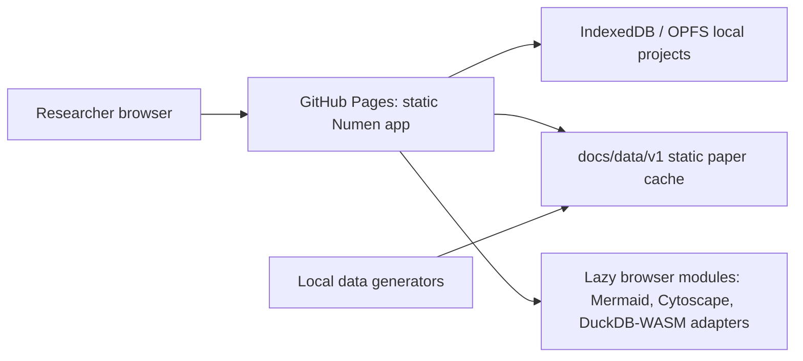

# Numen

Live site: https://baditaflorin.github.io/numen/

Repository: https://github.com/baditaflorin/numen

Support development: https://www.paypal.com/paypalme/florinbadita

Numen is a static-first academic writing platform for drafting, citations, literature review, figures, and submission-ready PDFs.

## Quickstart

```bash
npm install
make data
make build
make pages-preview
make test
```

## Architecture

Numen is a Mode B GitHub Pages app. The runtime surface is static: the browser loads the app, static paper metadata, and versioned artifacts from `docs/`. Offline/local generators refresh small committed data files and can publish large release artifacts later.



## Documentation

- Architecture: docs/architecture.md
- Data contract: docs/data.md
- Deployment: docs/deploy.md
- ADRs: docs/adr/
- Postmortem: docs/postmortem.md

## Local Hooks

```bash
make install-hooks
```

Hooks run formatting, linting, type checks, tests, smoke tests, and secret scanning locally. This project intentionally does not use GitHub Actions.
