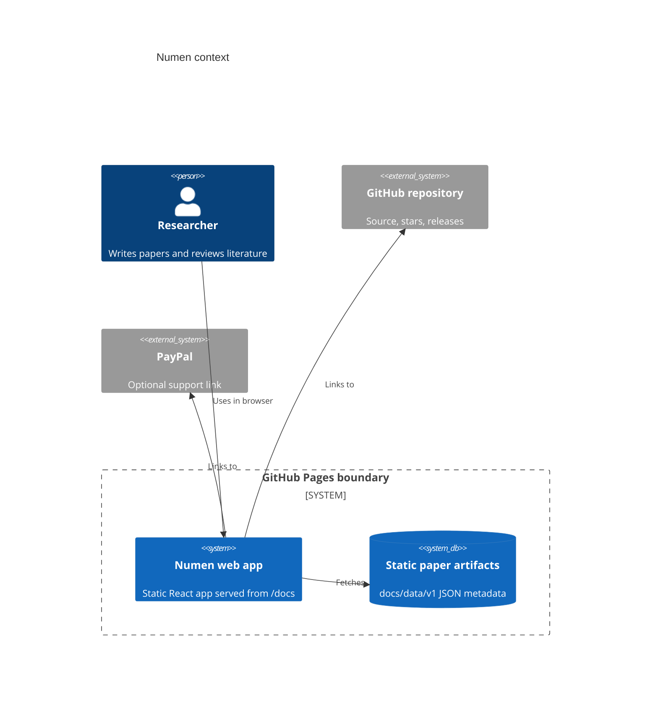
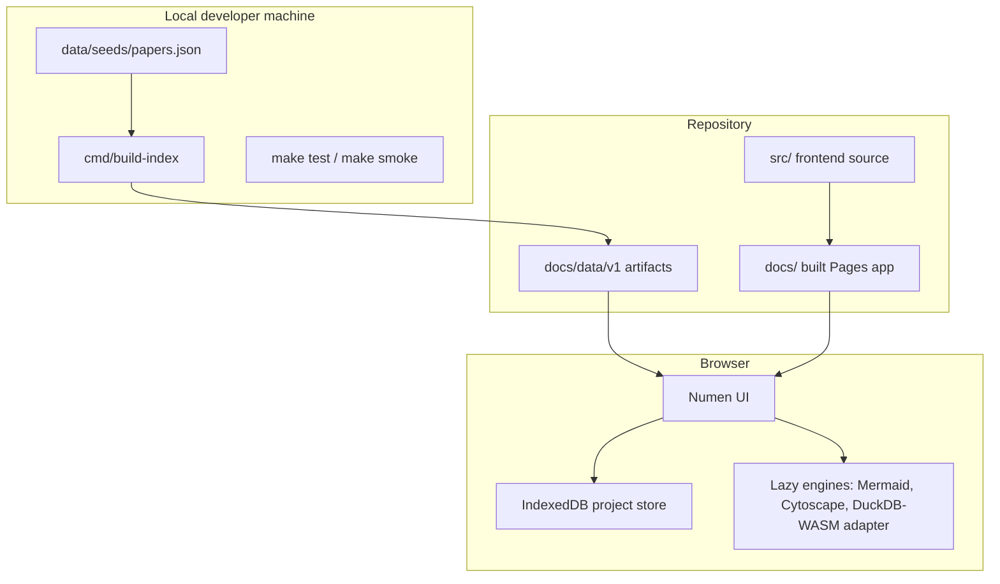

# Architecture

Numen is a Mode B GitHub Pages application: static at runtime, with local data generators producing versioned artifacts.

The browser owns private drafts. The repository owns public source code and generated public research metadata. There is no runtime API in v1.
